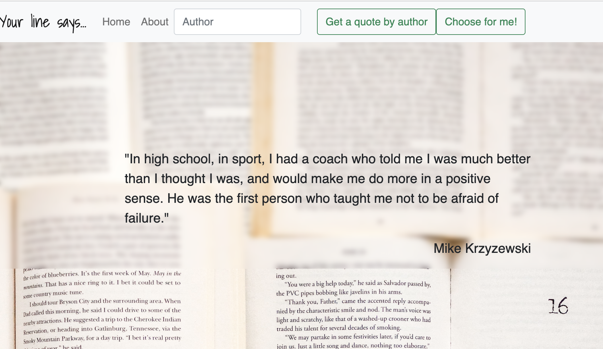
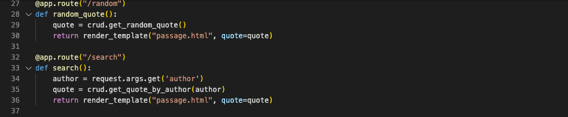
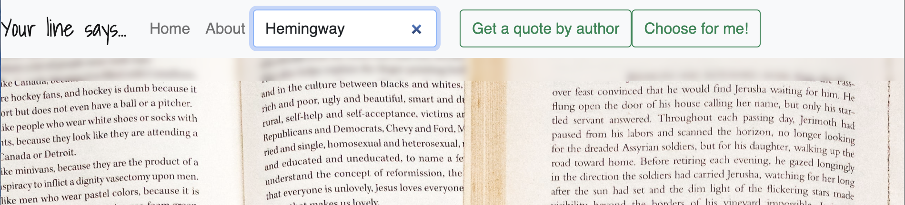
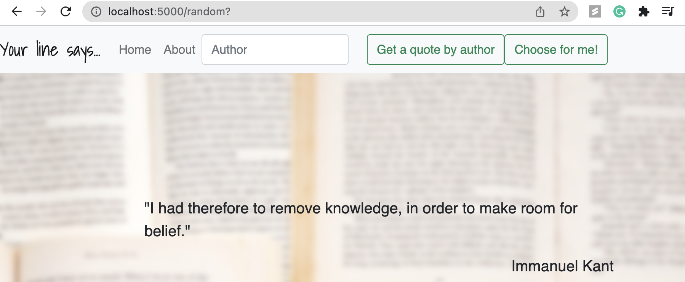

<h1 align="center">
  <a href="https://github.com/asya-code/your_line_says.git">
    <!-- Please provide path to your logo here -->
    
Your line says...

  </a>
</h1>

 

Table of Contents

- [About](#about)
  - [Built With](#built-with)
- [Features](#features)
- [Getting Started](#getting-started)
  - [Installation](#installation)
  - [Launch your server](#launch-your-server)

- [Roadmap](#roadmap)

---

## About

You'r line says... is a cute little application which gives you inspiring citations by your favorite authors and offers it's own sugested citations.

 

 
 

### Built With

Backend is powered by Python with Flask web framework and SQLAlchemy as its ORM, PostgreSQL for database. The front-end is written in HTML, Jinja and Javascript. Bootstrap and css were used to style the app.

 

## Features

Guests can enter their favorite author's name in the search field to get his/her random citation.

 

Or give the choice to the app and get absolutely random citation! 

 

## Getting Started

### Installation

Retrieve an entire repository from a hosted location via URL
 

 &nbsp <b> git clone https://github.com/asya-code/your_line_says.git </b> 

You’d then create a virtual environment:

 &nbsp <b> virtualenv env </b> 

Next, you’d activate that environment:
 

 &nbsp <b> source env/bin/activate </b> 

Finally, you’d use pip3 to install all of the requirements:
 

 &nbsp <b> (env) $ pip3 install -r requirements.txt </b> 

The -r option lets you supply a text file in the format pip3 freeze produces. This command should install all of the listed libraries.

To confirm that the correct packages are installed, you’d just run:
 

 &nbsp <b> pip3 freeze </b> 

### Launch your server

Once you’ve set up your virtual environment, activated it, and installed Flask, you should just be able to type:
 

 &nbsp <b> python3 server.py </b> 

## Roadmap

Project started on 06.14.2022, ended on 06.18.2022

Steps:

MVP
- Users can search for the citation by their favorite author

2.0
- Users can get random citation chosen by the app's algorithm

Main data is coming from the static database.